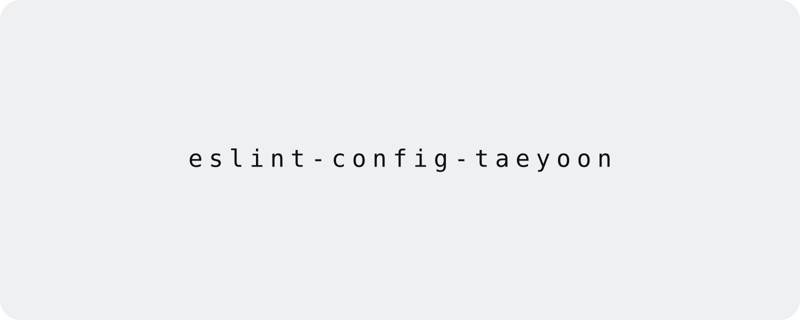

<!--
  This file is automatically generated based on resources/README.preset.md.
  Any direct modifications to this file will be lost.
  If changes are needed, please modify the resources/README.preset.md file.
  Then run ./scripts/readme_update.sh.
-->

<!-- Hero Image -->
<!--
  To replace the hero image, add resources/hero.png.
  For color-scheme-specific images, add resources/hero.light.png and resources/hero.dark.png.
  JPG files with the same names are also supported.
  When both a generic hero.png/hero.jpg and color-scheme-specific images exist, the light/dark images are drawn on top of the generic one in their matching mode.
  Then run yarn readme:update to embed existing hero images into resources/readme-hero.svg.
-->
<p align="center">
  <a href="https://github.com/taeyoon0137/eslint-config-taeyoon">
    
  </a>
</p>

<h1 align="center">eslint-config-taeyoon</h1>
<p align="center">Personal ESLint 9 flat shareable configs for JavaScript, TypeScript, React, and React Native projects.</p>

<p align="center">
  <a href="https://www.npmjs.com/package/eslint-config-taeyoon"></a>
  
  
  
</p>

- [🚀 시작하기](#시작하기)
- [🧭 역할](#역할)
- [📦 사용법](#사용법)
- [🛠️ 스크립트](#스크립트)
- [🚢 배포](#배포)
- [🗂️ 레포지토리 구성](#레포지토리-구성)

<a id="시작하기"></a>

## 🚀 시작하기

```sh
yarn add -D eslint typescript eslint-config-taeyoon
```

이 패키지는 preset에서 사용하는 ESLint plugin과 parser를 함께 포함합니다. 사용하는 프로젝트에서는 ESLint `^9.7.0`과 TypeScript `>=4.8.4 <6.1.0`을 peer dependency로 맞춰야 합니다. TypeScript parser를 base preset에서 함께 불러오므로 JavaScript 프로젝트에서도 TypeScript peer dependency가 필요합니다.

에이전트에게 설치와 설정을 맡길 때는 아래 한 줄을 그대로 사용할 수 있습니다.

```text
eslint-config-taeyoon을 설치하고, 패키지에 포함된 node_modules/eslint-config-taeyoon/AGENTS.md를 참조해 현재 프로젝트에 맞는 ESLint flat config를 구성해줘.
```

<a id="역할"></a>

## 🧭 역할

이 저장소는 개인 프로젝트에서 반복해서 사용하는 ESLint 9 flat config를 패키지로 배포합니다.

- `eslint-config-taeyoon`과 `eslint-config-taeyoon/base`는 JavaScript, TypeScript, import 정렬, unused imports, Prettier 호환 규칙을 제공합니다.
- `eslint-config-taeyoon/react`는 base preset에 React와 React Hooks 규칙을 더합니다.
- `eslint-config-taeyoon/react-native`는 React preset에 React Native 규칙을 더합니다.
- `eslint-config-taeyoon/prettier`는 이 저장소의 `.prettierrc.json`을 export합니다.

이 저장소는 애플리케이션 런타임, 배포 설정, 프로젝트별 ESLint override를 제공하지 않습니다. 소비하는 프로젝트에서 필요한 ignore, parser option, 환경별 override를 추가로 조합합니다.

<a id="사용법"></a>

## 📦 사용법

### Base

```js
import taeyoon from 'eslint-config-taeyoon';

export default [...taeyoon];
```

명시적인 subpath가 필요하면 같은 preset을 `eslint-config-taeyoon/base`에서 가져올 수 있습니다.

```js
import base from 'eslint-config-taeyoon/base';

export default [...base];
```

### React

```js
import react from 'eslint-config-taeyoon/react';

export default [...react];
```

React preset은 standalone preset입니다. base JavaScript, TypeScript, import 정렬, unused imports, React, React Hooks, Prettier 호환 설정을 포함합니다.

### React Native

```js
import reactNative from 'eslint-config-taeyoon/react-native';

export default [...reactNative];
```

React Native preset은 standalone preset입니다. base와 React preset에 React Native 규칙을 더합니다.

### Prettier

```json
{
  "prettier": "eslint-config-taeyoon/prettier"
}
```

패키지 export로 `.prettierrc.json`을 노출하므로, 소비하는 도구가 package subpath를 읽을 수 있을 때 재사용할 수 있습니다.

<a id="스크립트"></a>

## 🛠️ 스크립트

| 명령어 | 설명 |
| :--- | :--- |
| `yarn build` | `dist`를 지우고 TypeScript 선언과 JavaScript 산출물을 빌드합니다. |
| `yarn build:clear` | 생성된 `dist` 디렉터리를 삭제합니다. |
| `yarn build:types` | `tsc -b`와 `tsc-alias`를 실행합니다. |
| `yarn changeset` | 다음 릴리스의 버전 변경 종류와 changelog 요약을 `.changeset` 파일로 작성합니다. |
| `yarn test` | 빌드 후 smoke test를 실행합니다. |
| `yarn test:smoke` | package export, 대표 lint 동작, `npm pack --dry-run` 포함 파일을 확인합니다. |
| `yarn readme:update` | `resources/README.preset.md`를 기준으로 `README.md`와 `resources/readme-hero.svg`를 재생성합니다. |
| `yarn version-packages` | 누적된 changeset을 버전과 changelog에 반영합니다. 일반 릴리스에서는 GitHub Actions가 실행합니다. |
| `yarn release` | 테스트를 통과한 미배포 버전을 npm에 게시합니다. GitHub Actions 전용 명령입니다. |

<a id="배포"></a>

## 🚢 배포

배포는 [`.github/workflows/release.yml`](./.github/workflows/release.yml)의 GitHub Actions와 Changesets가 담당합니다. 로컬에서 `package.json` 버전을 직접 변경하거나 `yarn npm publish`를 실행하지 않습니다.

패키지 동작이나 공개 API가 바뀌는 작업에는 커밋 전에 changeset을 추가합니다.

```sh
yarn changeset
```

변경 종류를 `patch`, `minor`, `major` 중에서 선택하고 changelog에 들어갈 요약을 작성한 뒤 생성된 `.changeset/*.md` 파일을 변경사항과 함께 커밋합니다. 문서나 CI 설정처럼 패키지를 배포할 필요가 없는 변경에는 changeset을 추가하지 않습니다.

`main` 브랜치에 changeset이 들어오면 Release workflow가 테스트와 high-severity audit을 실행한 뒤 `Chore: Version packages` pull request를 생성하거나 갱신합니다. 이 pull request를 병합하면 같은 workflow가 변경된 버전과 changelog를 npm registry에 게시합니다. pending changeset이 없어도 `package.json`의 버전이 npm에 아직 없다면 해당 버전을 게시합니다.

npm package의 Trusted Publisher에는 GitHub Actions의 `taeyoon0137/eslint-config-taeyoon` 저장소와 `release.yml` workflow를 등록합니다. Release workflow는 `id-token: write` 권한으로 단기 OIDC 자격 증명을 발급받아 provenance와 함께 게시하므로 장기 npm token이나 Actions secret이 필요하지 않습니다. GitHub Actions 설정에서는 pull request 생성 권한을 허용해야 합니다.

외부 GitHub Action은 immutable commit SHA로 고정되어 있습니다. 버전을 갱신할 때는 공식 릴리스의 SHA인지 확인하고 release workflow의 주석 버전도 함께 변경합니다.

`package.json`의 `files`에는 `AGENTS.md`가 포함되어 있어야 합니다. 이 파일은 패키지를 설치한 프로젝트의 에이전트가 `node_modules/eslint-config-taeyoon/AGENTS.md`로 참조하는 설치 후 지침입니다.

<a id="레포지토리-구성"></a>

## 🗂️ 레포지토리 구성

```plaintext
eslint-config-taeyoon
├── .changeset/
│   ├── config.json             # Changesets 버전과 changelog 정책
│   └── README.md               # Changesets 사용 안내
├── .github/
│   └── workflows/
│       └── release.yml         # version PR 생성과 npm 배포 workflow
├── src/
│   ├── configs/                # 외부로 노출되는 preset 조합
│   ├── rules/                  # plugin별 ESLint flat config 조각
│   └── types/                  # 공유 타입 정의
├── @types/                     # 패키지 타입 보강과 누락 타입 선언
├── tests/
│   └── smoke.cjs               # package export, 대표 lint, npm pack 결과 smoke test
├── resources/
│   ├── README.preset.md        # README 본문의 source of truth
│   ├── readme-hero.preset.svg  # README 히어로 SVG wrapper의 source of truth
│   └── readme-hero.svg         # README 생성 명령으로 만들어지는 히어로 SVG 결과물
├── scripts/
│   └── readme_update.sh        # README와 히어로 SVG 재생성 명령
├── dist/                       # 빌드 산출물 (직접 수정으로 끝내지 않음)
├── .prettierrc.json            # Prettier 설정 (eslint-config-taeyoon/prettier 으로 export)
├── tsconfig.json               # TypeScript 빌드 설정
├── package.json                # 패키지 메타데이터와 exports
├── AGENTS.md                   # 작업 지침
├── CLAUDE.md                   # AGENTS.md 심볼릭 링크
└── README.md                   # 자동 생성 결과물
```
